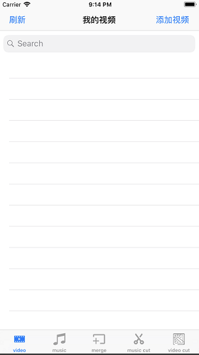
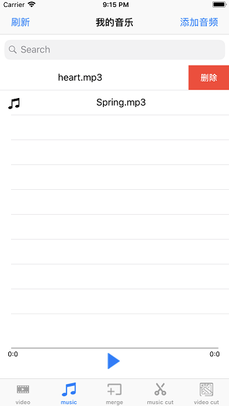
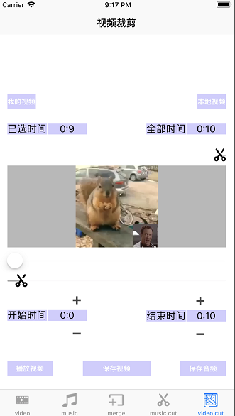
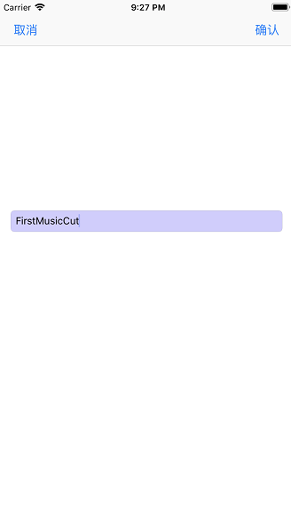
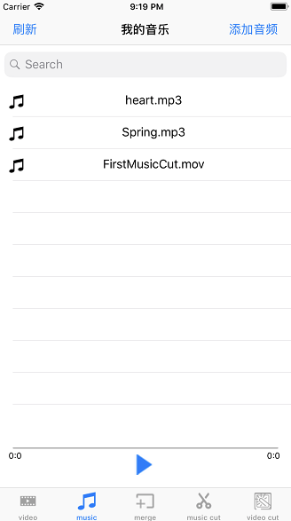

## Regas
151220154 余翔 
#### 概述
Regas是一个可以用来进行对音视频进行裁剪，拼接的软件。具体功能分为： 
* 视频展示及播放
* 音频展示及播放
* 视频剪辑及转换
* 音频剪辑
* 音频拼接

***
#### 功能实现
##### 视频展示及播放

 
左侧视图为展示视频页面，可通过点击“本地视频”按钮从本地视频中添加视频。右侧视图则是点击“本地视图”之后显示的界面。在“我的视频”中通过滑动来删除视频，点击可以播放视频。在搜索栏中可以对视频进行搜索。
##### 音频展示及播放
 
此视图是展示音频视图，点击“本地音频”可以添加本地音频，点击音频文件可以进行播放，滑动进行删除，下面进度条用来显示视频播放情况。
##### 音频剪辑
 
通过点击“我的音乐”和“本地音乐”来进行对音频的选取。此视图中有两个音频图，最上方音频图显示当前音高情况，随着音乐播放而改变。下方波形图则是整个音频的波形，方便对音频进行剪辑，可以通过滑动波形图上的slider来调节音频的播放。通过滑动上下两个轨道，来大范围选择音频的开始与播放时间，通过按键“+”以及“-”来对时间进行微调。
##### 视频剪辑
 
通过点击“我的视频”和“本地视频”来进行对视频的选取。中间的View用来展示视频，可以通过调节view上面的slider来控制视频的播放。通过滑动上下两个轨道，来大范围选择音频的开始与播放时间，通过按键“+”以及“-”来对时间进行微调。
##### 音频拼接
 
通过点击“我的”音乐来选取音频库文件。通过点击音频文件进行音频的播放，滑动音频进行音频的删除及移动（忘记写了。。。）可以通过滑动slider来调节整个音频的播放。
##### 音视频存储

 
在剪辑、拼接视图中完成视频的编辑后，点击完成按钮，会出现左侧视图，用于编辑文件的具体信息（目前只显示文件的姓名）。点击完成后，等待程序运行结束就会出现右侧视图，显示音频或者视频编辑完成 
 
最后完成编辑，在视频库或者音频库（如图）就可以查看和使用音视频文件了。
***
#### 不足 
* 没有合理的设计界面
* 交互这一块的设计不是很合理和细致
* 功能还不是很完善（音视频的变速、音视频分享没有实现）
***
#### 说明
* 使用cocoapods做第三方管理
* 使用EZAudio第三方库处理音频可视化

